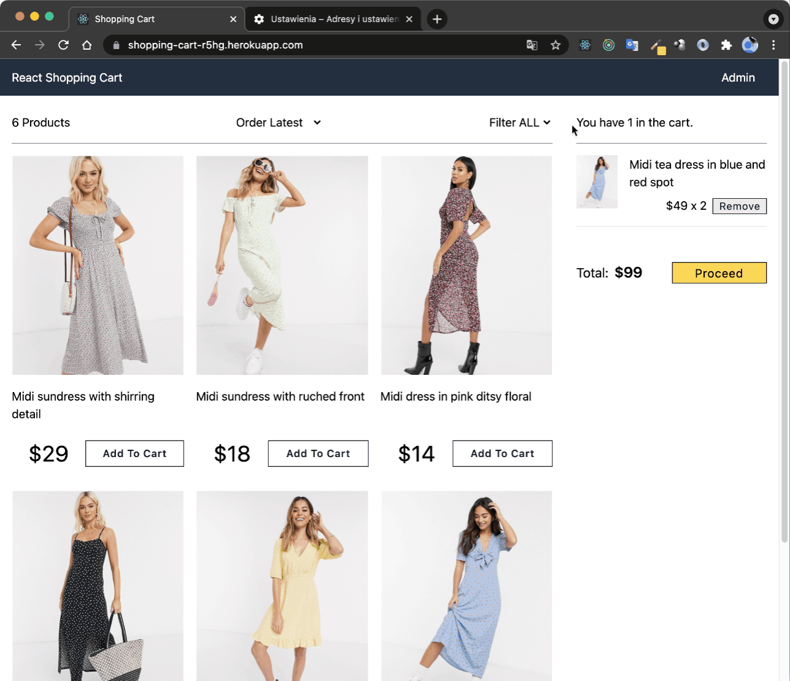
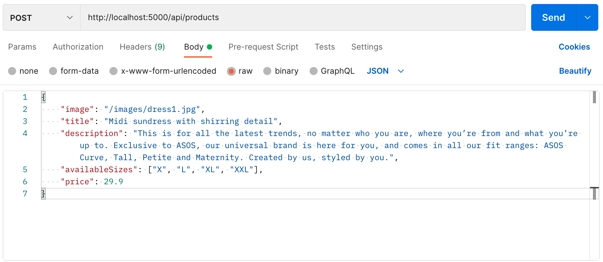

# React Shopping Cart 

## About the project
Test project for practicising the usage of redux and redux-thunk architecture inside of the React apps.

## Materials used
- [React & Redux Tutorial - Full Shopping Cart in 4 Hours [2020]](https://www.youtube.com/watch?v=nKyrXWH5XLM)
- [Build ECommerce Shopping Cart By React & Redux 2020 Edition
](https://www.udemy.com/course/build-ecommerce-website-by-react-redux-in-one-hour)



## Live Preview
[DEMO 🚀](https://shopping-cart-r5hg.herokuapp.com/)  

## 🧰 Stack
1. JavaScript (arrow functions, reduce, map, filter, object destructuring, spread operator, ternary operator, logical AND)
2. React (react-router-dom, prop-types, Hooks, Atomic Design)
3. Redux (react-redux, redux-thunk, subscribe)  
4. Node (express, Enviroment Variables, nodemon)  
5. MongoDB (mongoose, shortId, Community Server)  
6. VS Code (ES6 Snippets)
7. Chrome (React Developer Tools, Redux Developer Tools).  
8. Postman (send, get, put and delete requests to API)
9. Deployment (Heroku, MongoDB Atlas Cloud)

## 🚧 My contributions to the project
I completely rebuilt the project. [There](https://github.com/basir/react-shopping-cart) is repository from course to compare changes I did.

### 🔴 [Tailwind CSS](https://tailwindcss.com) used instead global styles from index.css

The whole project has been rebuilt with [Tailwind CSS](https://tailwindcss.com). Also I added many of my own styles.  

Instead using library react-reveal to creating animations I created my own animations (I had to do some changes in tailwing.config.js).

### 🔴 Refactored and expanded [Redux](https://redux.js.org/)

The structure of the data in Redux was reorganised. I rebuild actions and reducers (I moved business logic of updating state from actions to reducers to make the code cleaner). I used store.subscribe() to save part of state in localStorage and used it to initialize store.

### 🔴 I rebuild whole project using functional components

Project from course was created using class components. I used functional components and hooks to rebuilt the project. I used hooks: useState, useEffect, useDispatch, useSelector.

### 🔴 I built smaller components and used [Atomic Design](https://bradfrost.com/blog/post/atomic-web-design/) 

Instead building the whole project using only 4 components I split the code into smaller components. Also I reorganized components structure using Atomic Design

### 🔴 I built my own modal component

I didn't use library react-modal. I created my own reusable modal component. I used redux to open and close modals.

### 🔴 I expanded backend app

In the course was shown minimalistic backend server. I improved it. I created and moved controllers, models, routes into separated folders. I prepared structure to develop the app.   

Also I upgrated librares so I have to do some breaking changes (I didn't use deprecated bodyparser, I changed calling mongoose.connect())

## Installation
1. To run the project locally firstly you have to install [MongoDB Community Server](https://www.mongodb.com/try/download/community) and run it. You can also install [Compass](https://docs.mongodb.com/compass/current/install/) to visualize data in database and use for example [Postman](https://www.postman.com/) to load products data into the MongoDB.

On Mac to start Mongo DB type in terminal windows
```
mongod --config /usr/local/etc/mongod.conf

mongo
```

2. Clone this repository
3. In the command line type `npm install` in the project root folder
4. Then `npm run server` to start the backend app
5. In second terminal window type `npm start` to start the frontend app

You have to create POST request in Postman to address: `http://localhost:5000/api/products`. In the body section check raw and select JSON. Then copy example object from postman.json and press Send.  




## ⌨️ Code example


- ### Modal
I created reusible Modal component

#### `Modal.jsx:`
```
export default function Modal({ onCloseModal, children, isOpen }) {
  if (!isOpen) {
    return null;
  }

  return (
    <div className="fixed inset-0 bg-black bg-opacity-70 ">
      <div className="absolute left-10 top-32 right-10 border bg-white overflow-auto rounded p-5 pb-20 animate-pop-up lg:inset-x-20 lg:inset-y-20">
        <button
          className="absolute right-6 top-6 border border-gray-500 rounded-sm px-2 py-0 bg-gray-100 hover:border-gray-900  "
          onClick={onCloseModal}
        >
          x
        </button>
        {children}
      </div>
    </div>
  );
}
```
#### `Usage of <Modal/> component`

```
<Modal isOpen={isOrderDetailOpen} onCloseModal={handleCloseModal}>
      {/* sd */}      
</Modal>
```
